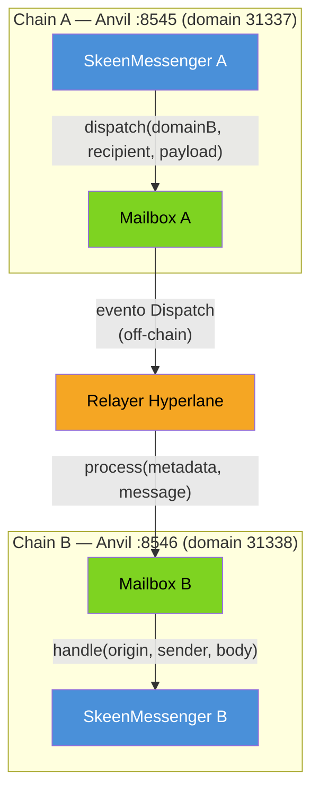
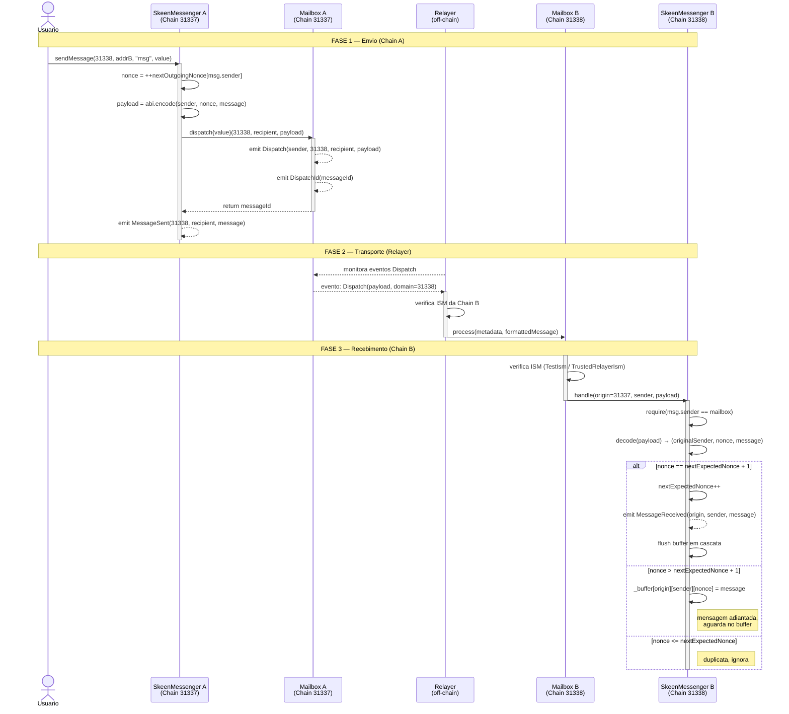

# Documentação Técnica — SkeenMessenger

**Disciplina:** Sistemas Distribuídos
**Ambiente:** Foundry + Hyperlane + Anvil (local)
**Linguagem:** Solidity ^0.8.0

---

## Sumário

1. [Introdução](#1-introdução)
2. [Arquitetura do Sistema](#2-arquitetura-do-sistema)
3. [Perguntas e Respostas Técnicas](#3-perguntas-e-respostas-técnicas)
4. [Diagrama de Sequência Detalhado](#4-diagrama-de-sequência-detalhado)
5. [Tutorial Passo a Passo](#5-tutorial-passo-a-passo)
6. [Referência de Comandos](#6-referência-de-comandos)
7. [Relação com o Algoritmo de Skeen](#7-relação-com-o-algoritmo-de-skeen)

---

## 1. Introdução

### 1.1 Contexto: Ordenação de Mensagens em Sistemas Distribuídos

Em sistemas distribuídos, processos independentes trocam mensagens por canais não confiáveis. Um dos problemas fundamentais dessa área é garantir que todos os nós do sistema entreguem as mensagens na **mesma ordem**, mesmo que a rede as entregue fora de sequência.

Esse requisito é chamado de **Ordem Total de Entrega** (*Total Order Delivery*) e é a base para construir sistemas replicados consistentes, como caixas de banco, contadores distribuídos e ledgers.

### 1.2 O Algoritmo de Skeen

O algoritmo de Skeen (1982) é um protocolo clássico de ordenação total para sistemas assíncronos. Sua ideia central é:

1. O emissor atribui um **timestamp lógico (nonce)** a cada mensagem antes do envio.
2. O receptor mantém controle do próximo nonce esperado (`nextExpectedNonce`).
3. Mensagens que chegam fora de ordem ficam em um **buffer** até que todas as anteriores tenham sido entregues.
4. Quando a mensagem esperada chega, ela é entregue e o buffer é esvaziado em cascata.

Isso garante que, independentemente da ordem de chegada na rede, a **entrega ao processo de aplicação** é sempre sequencial e total.

### 1.3 O Projeto SkeenMessenger

O `SkeenMessenger` é uma implementação do princípio de Skeen sobre infraestrutura blockchain real. Cada "rede" é simulada por uma instância **Anvil** (blockchain local do Foundry), e o transporte entre elas é feito pelo protocolo **Hyperlane** — um sistema de mensagens cross-chain com verificação criptográfica.

A combinação resulta em um sistema onde:
- Mensagens cruzam blockchains distintas via **Relayer**
- A **ordem total** é garantida por nonce mesmo se o Relayer entregar fora de sequência
- A **segurança** é fornecida pelo módulo ISM (*Interchain Security Module*) do Hyperlane

---

## 2. Arquitetura do Sistema

### 2.1 Componentes Principais

| Componente | Descrição |
|---|---|
| **Anvil** | Blockchain Ethereum local (Foundry). Expõe API JSON-RPC em `localhost:PORTA` |
| **Mailbox** | Contrato Hyperlane que gerencia envio (`dispatch`) e recebimento (`process`) de mensagens cross-chain |
| **ISM** | *Interchain Security Module* — contrato na chain de **destino** que responde a pergunta: *"posso confiar nessa mensagem?"*. O Relayer chama `verify()` no ISM antes de entregar. Se retornar `false`, a mensagem é rejeitada. Em ambiente local usamos o `TrustedRelayerIsm`, que aprova qualquer mensagem entregue pelo endereço do Relayer configurado. Em produção existem ISMs com verificação de assinatura de validadores (multisig), provas de Merkle e zero-knowledge |
| **Hook** | Contrato que executa ações pós-envio (ex: inserir folha em Merkle Tree, cobrar taxa) |
| **Relayer** | Processo off-chain que monitora eventos na chain de origem e entrega mensagens na chain de destino |
| **SkeenMessenger** | Contrato de aplicação que implementa envio com nonce e recebimento com buffer FIFO |

### 2.2 Diagrama de Visão Geral



### 2.3 Estrutura de Arquivos do Projeto

```
SkeenMessenger_V2/
├── src/
│   └── SkeenMessenger.sol          # Contrato principal
├── test/
│   ├── SkeenMessenger.t.sol        # Testes com MockMailbox
│   └── SkeenMessengerChaos.t.sol   # Teste de entrega fora de ordem
├── script/
│   └── Deploy.s.sol                # Script de deploy
├── configs/
│   └── core-config.yaml            # Config do core Hyperlane
└── lib/
    ├── hyperlane-monorepo/          # Contratos oficiais do Hyperlane
    ├── forge-std/                   # Biblioteca de testes Foundry
    ├── openzeppelin-contracts/
    └── openzeppelin-contracts-upgradeable/
```

---

## 3. Perguntas e Respostas Técnicas

### 3.1 O que é um Anvil?

Anvil é o **nó Ethereum local** incluído no conjunto de ferramentas Foundry. Ao iniciar, ele:

- Cria 10 contas com 10.000 ETH cada (usando o mnemônico padrão `test test test ... junk`)
- Minera blocos instantaneamente (sem tempo de espera)
- Expõe uma API JSON-RPC em `http://localhost:PORTA`
- Aceita qualquer transação sem verificação real de gas

```bash
anvil --port 8545 --chain-id 31337   # Chain A
anvil --port 8546 --chain-id 31338   # Chain B
#   --port será a porta no qual o anvil rodará 
#   --chain-id é o identificador numérico da rede Ethereum, embutido em cada transação assinada. Ele serve para evitar que uma transação assinada
  numa rede seja reaproveitada em outra (replay attack protection — EIP-155).
```


A chave privada padrão da conta 0 (válida em qualquer Anvil com mnemônico padrão):

```
0xac0974bec39a17e36ba4a6b4d238ff944bacb478cbed5efcae784d7bf4f2ff80
Endereço: 0xf39Fd6e51aad88F6F4ce6aB8827279cffFb92266
```

> Anvil **não se comunica diretamente com outras instâncias** — ele apenas responde a chamadas. A comunicação entre chains é responsabilidade do Relayer.

---

### 3.2 Como o Anvil envia para uma IP e porta? Como ele faz o mapeamento?

Anvil **não envia nada proativamente**. Ele é um servidor passivo. O mapeamento entre chains é feito pelos arquivos de configuração do Hyperlane:

```yaml
# ~/.hyperlane/chains/anvil1/metadata.yaml
chainId: 31337
domainId: 31337
name: anvil1
rpcUrls:
  - http: http://localhost:8545

# ~/.hyperlane/chains/anvil2/metadata.yaml
chainId: 31338
domainId: 31338
name: anvil2
rpcUrls:
  - http: http://localhost:8546
```

O **Relayer** lê esses arquivos, conecta-se às duas chains via HTTP e executa o papel de mensageiro:

```
Relayer lê metadata.yaml
  → conecta em localhost:8545 (Chain A)
  → monitora eventos Dispatch da Mailbox_A
  → ao detectar evento: conecta em localhost:8546 (Chain B)
  → chama process() na Mailbox_B
```

---

### 3.3 O que é o Domain Chain?

É um **inteiro de 32 bits** (`uint32`) que identifica unicamente uma blockchain dentro do ecossistema Hyperlane. Funciona como o "identificador de rede" para roteamento de mensagens.

| Chain | Domain ID |
|---|---|
| Ethereum Mainnet | 1 |
| Polygon | 137 |
| Arbitrum One | 42161 |
| Anvil local (Chain A) | 31337 |
| Anvil local (Chain B) | 31338 |

No contrato, o domain é o primeiro argumento de `sendMessage`:

```solidity
// "Envie esta mensagem para a chain de domain 31338"
messengerOnChainA.sendMessage(31338, address(messengerOnChainB), "olá");
```

O Mailbox usa o domain para rotear a mensagem ao Relayer correto, que sabe qual endpoint RPC corresponde a esse domain.

---

### 3.4 Como casar a Mailbox com a Blockchain? É relação 1:1?

**Sim. É exatamente 1 Mailbox → 1 Blockchain.**

Cada chain possui um único contrato Mailbox deployado. O `SkeenMessenger` recebe o endereço da Mailbox no construtor, fixando essa relação:

```solidity
constructor(address _mailbox) {
    mailbox = IMailbox(_mailbox);  // aponta para a Mailbox DESTA chain
    owner = msg.sender;
}
```

A segurança desse vínculo é garantida pela verificação no `handle`:

```solidity
function handle(uint32 _origin, bytes32 _sender, bytes calldata _messageBody)
    external payable
{
    require(msg.sender == address(mailbox), "Only mailbox can call handle");
    // ...
}
```

Somente o contrato Mailbox desta chain pode chamar `handle`. Qualquer outro endereço é rejeitado — inclusive um atacante tentando forjar uma mensagem.

---

### 3.5 O que é o Relayer?

O Relayer é um **processo off-chain** (programa que roda no terminal) responsável por:

1. Monitorar eventos `Dispatch` emitidos pela Mailbox da chain de origem
2. Ler o payload da mensagem do evento
3. Verificar o ISM (módulo de segurança) da chain de destino
4. Chamar `process()` na Mailbox da chain de destino com a mensagem

```bash
hyperlane relayer \
  --chains anvil1 \
  --chains anvil2 \
  --registry ~/.hyperlane \
  --key $HYP_KEY
```

> **Sem o Relayer rodando, nenhuma mensagem cross-chain é entregue.** O `sendMessage` na chain A completa com sucesso (a transação é minerada), mas a mensagem nunca chegará na chain B.

O Relayer do Hyperlane é **permissionless** — qualquer pessoa pode rodar um e relayar mensagens. Em produção, existem Relayers gerenciados pelo time Hyperlane, mas qualquer um pode substituí-los.

---

### 3.6 O que é o Recipient?

O Recipient é o **contrato que recebe e processa a mensagem** na chain de destino. Ele deve implementar a interface `IMessageRecipient`:

```solidity
interface IMessageRecipient {
    function handle(
        uint32  origin,       // domain da chain de origem
        bytes32 sender,       // endereço do contrato emissor (em bytes32)
        bytes calldata body   // payload da mensagem
    ) external payable;
}
```

O `SkeenMessenger` **é** o recipient — ele implementa `handle`. No envio, o endereço do recipient é convertido para `bytes32`:

```solidity
// Conversão address → bytes32 (padding de zeros à esquerda)
bytes32 recipient = bytes32(uint256(uint160(_recipient)));
// Ex: 0xe7f1...0512 → 0x000000000000000000000000e7f1...0512
```

A Mailbox da chain destino chama `handle` no endereço informado pelo emissor ao fazer `dispatch`.

---

### 3.7 Como enviar mensagem de uma Anvil para outra?

Após o deploy completo (core Hyperlane + SkeenMessenger + Relayer rodando):

```bash
cast send <SKEEN_MESSENGER_ANVIL1> \
  "sendMessage(uint32,address,string)" \
  31338 \
  <SKEEN_MESSENGER_ANVIL2> \
  "hello from anvil1" \
  --rpc-url http://localhost:8545 \
  --private-key $PRIVATE_KEY
```

Verificar recebimento na chain B:

```bash
cast logs \
  --rpc-url http://localhost:8546 \
  --address <SKEEN_MESSENGER_ANVIL2> \
  --from-block 0
```

O texto da mensagem aparece codificado em hex no campo `data` do log. Por exemplo, `"hello from anvil1"` → `68656c6c6f2066726f6d20616e76696c31`.

---

### 3.8 Como ver o saldo de uma conta?

```bash
# Em wei
cast balance 0xf39Fd6e51aad88F6F4ce6aB8827279cffFb92266 \
  --rpc-url http://localhost:8545

# Em ETH (mais legível)
cast balance 0xf39Fd6e51aad88F6F4ce6aB8827279cffFb92266 \
  --rpc-url http://localhost:8545 \
  --ether
```

---

### 3.9 Como ver o saldo gasto em cada transação?

Cada transação tem `gasUsed` × `gasPrice` = custo total em wei.

```bash
# 1. Obter o recibo completo da transação
cast receipt <TX_HASH> --rpc-url http://localhost:8545

# 2. Calcular custo em wei (via JSON + jq)
cast receipt <TX_HASH> --rpc-url http://localhost:8545 --json \
  | jq '(.gasUsed | tonumber) * (.effectiveGasPrice | tonumber)'
```

Ou comparar saldo antes/depois:

```bash
cast balance <CONTA> --rpc-url http://localhost:8545 --ether  # antes
cast send ...                                                  # transação
cast balance <CONTA> --rpc-url http://localhost:8545 --ether  # depois
# diferença = custo da transação
```

---

### 3.10 Padrão: um lado manda um inteiro, o outro incrementa e responde

Este padrão de **chamada-resposta bidirecional** (ping-pong) não está implementado na versão atual do `SkeenMessenger`, mas é um exercício natural de extensão. O fluxo seria:

```
Chain A envia n=1 → Chain B recebe, calcula n+1=2, envia de volta → Chain A recebe 2
```

Para isso, cada lado precisaria:
1. Conhecer o endereço do contrato na outra chain
2. Ter ETH suficiente para pagar o `dispatch` de retorno
3. Implementar lógica em `handle` para detectar se é uma "requisição" (enviar resposta) ou uma "resposta" (processar resultado)

```solidity
// Exemplo de extensão em handle():
function handle(uint32 _origin, bytes32 _sender, bytes calldata _body) external payable {
    (address originalSender, uint256 nonce, string memory msg_) =
        abi.decode(_body, (address, uint256, string));

    // Se a mensagem contém um número, incrementa e responde
    uint256 n = abi.decode(bytes(msg_), (uint256));  // simplificado
    uint256 fee = mailbox.quoteDispatch(_origin, _sender, abi.encode(n + 1));
    mailbox.dispatch{value: fee}(uint32(_origin), _sender, abi.encode(n + 1));
}
```

---

## 4. Diagrama de Sequência Detalhado

O diagrama abaixo mostra o fluxo completo de uma mensagem desde o `sendMessage` até o evento `MessageReceived`, incluindo o buffer FIFO para ordenação.



---

## 5. Tutorial Passo a Passo

### Pré-requisitos

- [Foundry](https://book.getfoundry.sh/getting-started/installation) instalado (`forge`, `cast`, `anvil`)
- Node.js ≥ 18 (para o Hyperlane CLI)
- `jq` instalado (para parsear JSON nos comandos de diagnóstico)

---

### Passo 1 — Instalar dependências

```bash
# Hyperlane CLI
npm install -g @hyperlane-xyz/cli
hyperlane --version   # testado com 35.1.0

# Clonar e inicializar submódulos do projeto
cd SkeenMessenger_V2
git submodule update --init --recursive
```

Compilar o projeto para verificar que tudo está correto:

```bash
forge build
```

---

### Passo 2 — Iniciar as duas Anvils

Em dois terminais separados:

```bash
# Terminal 1 — Chain A
anvil --port 8545 --chain-id 31337

# Terminal 2 — Chain B
anvil --port 8546 --chain-id 31338
```

Ambas iniciam com o mesmo conjunto de contas. A chave privada da conta 0:

```
0xac0974bec39a17e36ba4a6b4d238ff944bacb478cbed5efcae784d7bf4f2ff80
```

---

### Passo 3 — Registrar as chains no Hyperlane

```bash
mkdir -p ~/.hyperlane/chains/anvil1
mkdir -p ~/.hyperlane/chains/anvil2
```

**`~/.hyperlane/chains/anvil1/metadata.yaml`**:

```yaml
chainId: 31337
domainId: 31337
name: anvil1
protocol: ethereum
rpcUrls:
  - http: http://localhost:8545
nativeToken:
  name: Ether
  symbol: ETH
  decimals: 18
```

**`~/.hyperlane/chains/anvil2/metadata.yaml`**:

```yaml
chainId: 31338
domainId: 31338
name: anvil2
protocol: ethereum
rpcUrls:
  - http: http://localhost:8546
nativeToken:
  name: Ether
  symbol: ETH
  decimals: 18
```

---

### Passo 4 — Gerar configuração do Core Hyperlane

```bash
hyperlane core init
```

Quando solicitado, informe `0xf39Fd6e51aad88F6F4ce6aB8827279cffFb92266` como owner e beneficiary.

O comando cria `./configs/core-config.yaml`:

```yaml
defaultHook:
  type: merkleTreeHook
defaultIsm:
  relayer: "0xf39Fd6e51aad88F6F4ce6aB8827279cffFb92266"
  type: trustedRelayerIsm
owner: "0xf39Fd6e51aad88F6F4ce6aB8827279cffFb92266"
proxyAdmin:
  owner: "0xf39Fd6e51aad88F6F4ce6aB8827279cffFb92266"
requiredHook:
  beneficiary: "0xf39Fd6e51aad88F6F4ce6aB8827279cffFb92266"
  maxProtocolFee: "100000000000000000"
  owner: "0xf39Fd6e51aad88F6F4ce6aB8827279cffFb92266"
  protocolFee: "0"
  type: protocolFee
```

> `trustedRelayerIsm` é o módulo de segurança mais simples para desenvolvimento local — aceita mensagens entregues pelo relayer configurado sem verificação criptográfica adicional.

---

### Passo 5 — Deploy do Core Hyperlane (Mailbox, ISM, Hook)

```bash
export HYP_KEY=0xac0974bec39a17e36ba4a6b4d238ff944bacb478cbed5efcae784d7bf4f2ff80

# Deploy na Chain A
hyperlane core deploy \
  --registry ~/.hyperlane \
  --config ./configs/core-config.yaml \
  --key $HYP_KEY \
  --chain anvil1 \
  --yes

# Deploy na Chain B
hyperlane core deploy \
  --registry ~/.hyperlane \
  --config ./configs/core-config.yaml \
  --key $HYP_KEY \
  --chain anvil2 \
  --yes
```

Os endereços deployados ficam em:

```bash
cat ~/.hyperlane/chains/anvil1/addresses.yaml   # campo: mailbox
cat ~/.hyperlane/chains/anvil2/addresses.yaml   # campo: mailbox
```

---

### Passo 6 — Deploy do SkeenMessenger

```bash
export PRIVATE_KEY=0xac0974bec39a17e36ba4a6b4d238ff944bacb478cbed5efcae784d7bf4f2ff80

# Ler endereços da Mailbox gerados no passo anterior
export MAILBOX_A=$(grep 'mailbox:' ~/.hyperlane/chains/anvil1/addresses.yaml | awk '{print $2}' | tr -d '"')
export MAILBOX_B=$(grep 'mailbox:' ~/.hyperlane/chains/anvil2/addresses.yaml | awk '{print $2}' | tr -d '"')

# Deploy na Chain A
MAILBOX_ADDRESS=$MAILBOX_A forge script script/Deploy.s.sol \
  --rpc-url http://localhost:8545 \
  --broadcast \
  --private-key $PRIVATE_KEY

# Deploy na Chain B
MAILBOX_ADDRESS=$MAILBOX_B forge script script/Deploy.s.sol \
  --rpc-url http://localhost:8546 \
  --broadcast \
  --private-key $PRIVATE_KEY
```

Obter os endereços dos contratos deployados:

```bash
export SKEEN_A=$(cat broadcast/Deploy.s.sol/31337/run-latest.json \
  | jq -r '.transactions[] | select(.contractName == "SkeenMessenger") | .contractAddress')

export SKEEN_B=$(cat broadcast/Deploy.s.sol/31338/run-latest.json \
  | jq -r '.transactions[] | select(.contractName == "SkeenMessenger") | .contractAddress')

echo "SkeenMessenger A: $SKEEN_A"
echo "SkeenMessenger B: $SKEEN_B"
```

---

### Passo 7 — Iniciar o Relayer

Em um novo terminal, mantenha o Relayer rodando:

```bash
hyperlane relayer \
  --chains anvil1 \
  --chains anvil2 \
  --registry ~/.hyperlane \
  --key $HYP_KEY
```

> O Relayer precisa estar ativo para que mensagens sejam entregues. Sem ele, `sendMessage` executa com sucesso na chain A mas a mensagem nunca chega na chain B.

---

### Passo 8 — Testar envio de mensagem

```bash
# Enviar mensagem de Chain A para Chain B
cast send $SKEEN_A \
  "sendMessage(uint32,address,string)" \
  31338 \
  $SKEEN_B \
  "hello from anvil1" \
  --rpc-url http://localhost:8545 \
  --private-key $PRIVATE_KEY
```

Verificar entrega na Chain B:

```bash
cast logs \
  --rpc-url http://localhost:8546 \
  --address $SKEEN_B \
  --from-block 0
```

Verificar quantas mensagens foram processadas em ordem (deve retornar `1` após o envio):

```bash
cast call $SKEEN_B \
  "nextExpectedNonce(uint32,bytes32)(uint256)" \
  31337 \
  $(printf '0x000000000000000000000000%s' "${SKEEN_A#0x}") \
  --rpc-url http://localhost:8546
```

---

## 6. Referência de Comandos

### 6.1 Comandos `cast` Essenciais

| Ação | Comando |
|---|---|
| Ver saldo em ETH | `cast balance <ADDR> --rpc-url <RPC> --ether` |
| Recibo de transação | `cast receipt <TX_HASH> --rpc-url <RPC>` |
| Custo da transação (wei) | `cast receipt <TX_HASH> --rpc-url <RPC> --json \| jq '(.gasUsed\|tonumber)*(.effectiveGasPrice\|tonumber)'` |
| Enviar transação | `cast send <ADDR> "<FUNC_SIG>" <ARGS> --rpc-url <RPC> --private-key <KEY>` |
| Ler variável pública | `cast call <ADDR> "<FUNC_SIG>()(TYPE)" <ARGS> --rpc-url <RPC>` |
| Ver logs de eventos | `cast logs --rpc-url <RPC> --address <ADDR> --from-block 0` |
| Bloco mais recente | `cast block latest --rpc-url <RPC>` |
| Converter hex para texto | `cast --to-ascii <HEX>` |

### 6.2 Comandos `forge` Essenciais

| Ação | Comando |
|---|---|
| Compilar projeto | `forge build` |
| Rodar todos os testes | `forge test -v` |
| Rodar teste específico com trace | `forge test --match-test <NOME> -vvvv` |
| Rodar teste do caos | `forge test --match-test test_ChaosOutOfOrderDelivery -vvvv` |
| Deploy com broadcast | `forge script script/Deploy.s.sol --rpc-url <RPC> --broadcast --private-key <KEY>` |

### 6.3 Comandos Hyperlane CLI

| Ação | Comando |
|---|---|
| Gerar config do core | `hyperlane core init` |
| Deploy do core (por chain) | `hyperlane core deploy --chain <CHAIN> --config <CONFIG> --key <KEY> --yes` |
| Iniciar Relayer | `hyperlane relayer --chains <A> --chains <B> --registry ~/.hyperlane --key <KEY>` |
| Ver endereços deployados | `cat ~/.hyperlane/chains/<CHAIN>/addresses.yaml` |

### 6.4 Queries de Estado do Contrato

```bash
# Último nonce enviado por um remetente (Chain A)
cast call $SKEEN_A "nextOutgoingNonce(address)(uint256)" <SENDER_ADDR> \
  --rpc-url http://localhost:8545

# Último nonce recebido em ordem (Chain B)
# O endereço deve ser convertido para bytes32 (padding de zeros)
cast call $SKEEN_B \
  "nextExpectedNonce(uint32,bytes32)(uint256)" \
  31337 \
  $(printf '0x000000000000000000000000%s' "${SKEEN_A#0x}") \
  --rpc-url http://localhost:8546
```

---

## 7. Relação com o Algoritmo de Skeen

### 7.1 Mapeamento entre a Teoria e a Implementação

O algoritmo de Skeen define quatro elementos fundamentais. A tabela abaixo mostra como cada um é implementado no `SkeenMessenger`:

| Conceito de Skeen | Implementação no Contrato | Local no Código |
|---|---|---|
| Timestamp lógico | `nonce` incremental por remetente | `nextOutgoingNonce[msg.sender]` |
| Atribuição de timestamp | Incremento antes do `dispatch` | `uint256 nonce = ++nextOutgoingNonce[msg.sender]` |
| Controle de entrega | Próximo nonce esperado por par (origem, remetente) | `nextExpectedNonce[origin][senderKey]` |
| Buffer de mensagens adiantadas | Mapping tridimensional | `_buffer[origin][senderKey][nonce]` |
| Entrega em cascata | Loop que esvazia o buffer | `while (_buffer[...][next].length > 0)` |

### 7.2 Fluxo do Buffer — Analogia com Skeen

O **Teste do Caos** (`SkeenMessengerChaos.t.sol`) demonstra o mecanismo em ação. Três mensagens são enviadas em ordem (M1, M2, M3) mas entregues fora de ordem (M3, M2, M1):

```
Envio (Chain A):   M1(nonce=1) → M2(nonce=2) → M3(nonce=3)

Entrega (Chain B, fora de ordem):
  M3 recebida → nonce 3 > esperado 1 → vai para _buffer[...][3]
  M2 recebida → nonce 2 > esperado 1 → vai para _buffer[...][2]
  M1 recebida → nonce 1 == esperado 1 → ENTREGA
                                          → flush: entrega M2 do buffer
                                          → flush: entrega M3 do buffer

Resultado: M1, M2, M3 emitidas em ordem total ✓
```

### 7.3 Garantia de Ordem Total

A propriedade garantida é: **para qualquer par (origin, sender), as mensagens são entregues ao contrato de aplicação na mesma ordem em que foram enviadas**, independentemente da ordem de chegada pelo Relayer.

Formalmente:
- Se M_i é enviada antes de M_j (nonce_i < nonce_j), então `MessageReceived(M_i)` é emitido antes de `MessageReceived(M_j)`
- Mensagens duplicadas (nonce já entregue) são silenciosamente descartadas

### 7.4 Limitações em Relação ao Skeen Clássico

O Skeen clássico opera em um ambiente multicast com múltiplos processos votando no timestamp final. A implementação atual tem simplificações:

| Aspecto | Skeen Clássico | SkeenMessenger Atual |
|---|---|---|
| Atribuição de timestamp | Negociação entre processos | Atribuído unilateralmente pelo emissor |
| Número de participantes | N processos em multicast | 1 emissor → 1 receptor por par |
| Acordo no timestamp | Exige quórum | Não necessário (canal ponto-a-ponto) |
| Tolerância a falhas | Parcial (depende do modelo) | Nenhuma (buffer aguarda indefinidamente) |
| Canal | Rede TCP/IP | Blockchain + Relayer Hyperlane |

A simplificação é válida para o contexto ponto-a-ponto: como há apenas um emissor por par `(origin, senderKey)`, o timestamp (nonce) atribuído pelo emissor já é globalmente único e ordenado para aquele fluxo. Não é necessário acordo distribuído.

### 7.5 Execução dos Testes

```bash
# Testes básicos (MockMailbox)
forge test -v

# Teste de caos com trace completo (entrega fora de ordem)
forge test --match-test test_ChaosOutOfOrderDelivery -vvvv
```

Saída esperada do teste de caos:

```
[PASS] test_ChaosOutOfOrderDelivery()

Logs:
  === CHAOS: entregando M3, M2, M1 fora de ordem ===
  Entregando M3 (nonce=3) -> deve ir para o buffer
  Entregando M2 (nonce=2) -> deve ir para o buffer
  Entregando M1 (nonce=1) -> deve processar M1+M2+M3 em cascata
  SUCESSO: M1, M2 e M3 processadas na ordem correta!
```
